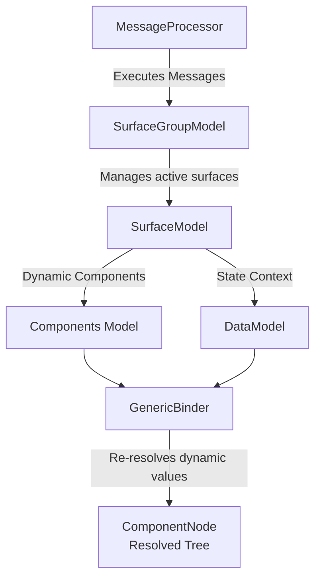

# A2UI Core Library (`a2ui_core`)

`a2ui_core` is a framework-agnostic Python library containing the core data models, reactive state management, and JSON schema validation logic for the A2UI protocol (v0.9 and onwards).

It provides the logic-neutral, visual-agnostic layer used by python-based server agents, rendering backends, and conformance testing frameworks.

## Features

- **Protocol Handling**: Symmetrical processing and validation of A2UI specification envelope messages (`CreateSurface`, `UpdateComponents`, `UpdateDataModel`, and `DeleteSurface`).
- **State Management**: Reactive state tracking driven by a high-performance custom `Signal` implementation and decoupled hierarchical models (`SurfaceGroupModel`, `SurfaceModel`, and `ComponentNode` layers).
- **DataContext**: Advanced data binding and function execution environment with support for dynamic path resolution and automatic dependency updates.
- **Catalog System**: Extensible catalog registry supporting compiled object models (`ModelCatalog`) and raw text-based schemas (`JsonCatalog`) for LLM prompt integration.
- **Validation & Integrity**: Strict validation engine combining **Pydantic** (compiled envelopes) and **JSON Schema Draft 2020-12** (dynamic catalogs) with advanced topological and integrity checks (cyclic layout detection, reachability analysis, orphan tracking, and recursive reference verification).

> [!IMPORTANT]
> **Specification Support**: The `a2ui_core` library strictly targets the **A2UI specification v0.9 and onwards**. Unlike client-side renderers that may support legacy v0.8 layouts for backward compatibility, this Python core library does not support legacy v0.8 protocol definitions.

## Architecture

The `a2ui_core` architecture aligns symmetrically with the client-side `@a2ui/web_core` engine, allowing exact parity when evaluating state representations and resolving dynamic layout values.



### Core Packages

#### 1. State Layer (`src/a2ui/core/state`)

- **`Signal`**: Thread-safe (where applicable) core reactive primitive. Allows components and rendering pipelines to subscribe to precise state increments.
- **`DataModel`**: Active state key-value dictionary path observer supporting reactive wildcard queries and path resolution.
- **`ComponentNode`**: Represents a live, reactively bound component instance in the final visual tree hierarchy. Automatically disposes of nested resources and subscriptions when unmounted.
- **`SurfaceModel`**: Orchestrates components and data model pipelines for a single viewport surface.
- **`SurfaceGroupModel`**: Manages a collection of active client rendering surfaces.

#### 2. Rendering Engine (`src/a2ui/core/rendering`)

- **`DataContext`**: Coordinates lexical scopes, resolves data paths (e.g., `/some/data`), and handles dynamic expressions.
- **`GenericBinder`**: Subscribes to relevant data path models and binds component properties dynamically.
- **`ComponentContext`**: Connects standard component models with their target `DataContext` execution environments.

#### 3. Message Processing (`src/a2ui/core/processing`)

- **`MessageProcessor`**: A stateless protocol processor. Translates raw incoming A2UI messages into structural mutations across the `SurfaceGroupModel` layer.

#### 4. Catalogs (`src/a2ui/core/catalog`)

- **`JsonCatalog`**: Loads raw JSON schemas directly, compiling schema-validated references dynamically for prompt injection.
- **`ModelCatalog`**: Compiles catalog rules based on structured Pydantic or standard object class configurations.

#### 5. Basic Catalog (`src/a2ui/core/basic_catalog`)

- **Basic Component Models**: Symmetrical declarations of core out-of-the-box components (`TextComponent`, `ButtonComponent`, `CardComponent`, etc.) conforming directly to standard schema configurations.
- **`BasicCatalog`**: Factory provider initializing standard schemas and layout parameters.

#### 6. Symmetrical Schemas (`src/a2ui/core/schema`)

- **Pydantic Message Wrappers**: Compiled Pydantic models representing `A2uiMessage`, envelopes, and capabilities configuration structures.
- **`constants`**: Spec constants defining default reachability links and single/list component reference parameters.

## Development & Testing

We use [uv](https://github.com/astral-sh/uv) for extremely fast and reliable environment management and task execution.

### Setup Environment

To synchronize the virtual environment and dependencies, run the following from the `agent_sdks/python` directory:

```bash
uv sync
```

### Running Tests

Run all unit, conformance, and structural integrity test suites:

```bash
# From the package directory (agent_sdks/python/a2ui_core)
uv run pytest
```

### Code Formatting

Format and lint source files before committing changes:

```bash
uv run pyink .
```
