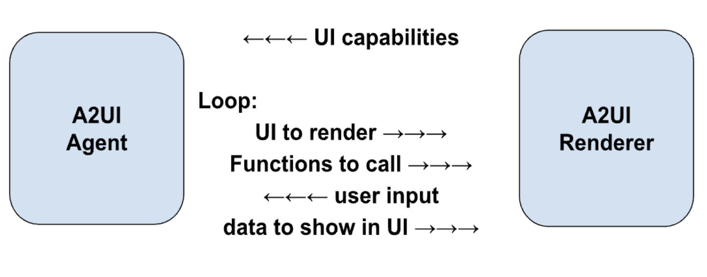
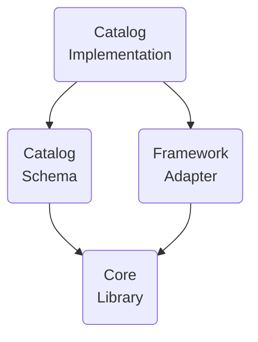

# Glossary

## A2UI protocol terms

Terms, required by A2UI protocol.

### A2UI agent and A2UI renderer

The A2UI protocol enables conversation between **agent** and **renderer**:
1. **Renderer** provides **UI capabilities** in the form of A2UI catalog and **instructions** on how to use it.
2. **Agent** iterates on the loop:
    - Provides **UI** and **functions** to call, taking into account the received catalog
    - Receives **user input**, communicated by renderer
    - Updates **data** to show in UI

While the protocol is designed for **AI-empowered agents**, it can work with deterministic agents as well. For example, an agent may return a pre-canned A2UI UI.

In case the agent is stateless or does not guarantee to preserve the catalog, the renderer should provide the catalog with every message.

And, sometimes, an agent is using a predefined catalog, thus forcing the renderers to either support this catalog or use an adapter. 

### GenUI Component

UI component, allowed for use by agent. Examples: date picker, carousel, button, hotel selector.

### Catalog

1. Itemized renderer capabilities:
    - List of components that the agent can use to generate UI
    - List of functions that can be invoked by renderer
    - Styles and themes
2. Explanation on how the renderer capabilities should be used.

It is observed that depending on use case, catalog components may be more or less specific to domain:

- **Less specific**:

  Basic UI primitives like buttons, labels, rows, columns, option-selectors and so on. 

- **More specific**:

  Components like HotelCheckout or FlightSelector.

### Basic Catalog

A catalog maintained by the A2UI team to get up and running quickly with A2UI.

See the [basic catalog](../specification/v0_10/json/basic_catalog.json).

### Surface

An area of UI, constructed by A2UI agent and managed by the A2UI renderer,
which consists of a number of components. Surfaces cannot nest.

### Agent architecture

There are options for A2UI agent:

- **Same-process or server-side**:

  Agent and renderer may reside in one process of a client side application. Example: desktop Flutter application.

  Or, renderer may reside on the box that displays UI, and agent may reside on another box (server).

- **Orchestrator agent**:

  The central orchestrator manages interactions between a user and several specialized sub-agents. The orchestrator can be in the same process or on the server.

- **Pulling / pushing**:

  An agent can wait for messages/requests from the renderer, or push messages/requests to it.

- **Stateful / stateless**:

  Agents can preserve state or be stateless.

- **Mixed with other protocols**:

  A2UI can be used in combination with other protocols. For example, an agent may be an MCP and/or A2A server.

- **Something else**:

  In addition to the above options, there is possibility for any custom variation.

### Renderer stack

Functionality of A2UI renderer consists of layers that can be developed separately and reused:

- **Core Library**:
  
  Set of primitives, needed to describe catalog and to interact with the agent.

  For example, see the [JavaScript web core library](../renderers/web_core/README.md).

- **Catalog Schema**:
  
  Definition of catalog in the form of JSON.

  For example, see the [basic catalog schema](../specification/v0_10/json/basic_catalog.json).

- **Framework adapter**:
  
  Code that implements the execution of the agent’s instructions in a concrete framework. For example:
  
  - JavaScript core and catalogs may be adapted to Angular, Electron, React and Lit frameworks.
  - Dart core and catalogs may be adapted to Flutter and Jaspr frameworks.

  See the [Angular adapter](../renderers/angular/README.md).

- **Catalog Implementation**:
  
  Implementation of the catalog schema for a framework.

  For example:
  
  - See the [Angular implementation of the basic catalog](../renderers/angular/src/v0_9/catalog/basic)
  

### A2UI message

A message between agent and renderer.

As the protocol allows streaming, any message can be finished (completely delivered) or not finished (partially delivered). A finished message may be completed (successfully delivered) or interrupted (delivery stopped because of some technical issues).

See the [data flow guide](concepts/data-flow.md).

### Agent turn

Set of messages sent by agent, before it starts waiting for user input.

### Data model

Observable, hierarchical, JSON-like object, shared between renderer and agent and updatable by both. Each Surface has a separate Data Model.

Components can be bound to nodes of the data model, in order to auto-update when the values are changed.

Data model allows bidirectional synchronization by capturing user interactions into a state object for transmission to the agent, while also allowing agent to push data updates back to the UI.

See the [data binding guide](concepts/data-binding.md).

### Data reference

In component definition, a reference to a data element, resolvable either by path in the data model or by value.

See the [example in the basic catalog](../specification/v0_10/json/basic_catalog.json#L18).

### Client function

A function provided for agent to invoke when needed.

Do not confuse with LLM tool:

| Feature      | Client Function                                                       | LLM Tool Invocation                                                               |
| ------------ | --------------------------------------------------------------------- | --------------------------------------------------------------------------------- |
| Executor     | A2UI Renderer                                                         | LLM requests invocation without concern about execution details.                  |
| Timing       | After the agent to renderer message is sent.                          | Before the agent to renderer message is sent.                                     |
| Purpose      | UI logic (Validation, visible toggles, Formatting)                    | Reasoning, Data Fetching, Backend Actions                                         |
| Definition   | Registered in client side function registry and advertised in catalog | Defined in ToolDefinition (passed to LLM)                                         |
| State Access | Access to DataContext and Input values.                               | No access to trigger requests to AI. Access to external APIs, databases, and services |

See the [example in common types](../specification/v0_9/json/common_types.json#L200).

### Action

A container for an interaction triggered by the user in the UI. Actions come in two types:
- **Event**: Dispatched to the agent for processing (e.g., clicking "Submit").
- **Function**: Executed locally on the renderer (e.g., opening a URL).

See the [detailed guide on actions](concepts/actions.md).

## Generative UI terms

Terms, not required by A2UI protocol, but commonly used in the context of generative UI.

### Known patterns of GenUI

- **Chat**:

  Pieces of generated UI appear one by one, sorted by time, in a vertically scrollable area, mixed with user input.

- **Canvas**:

  Space for collaboration with an agent.

- **Dashboard**:

  Pieces of generated UI are organized not by time, but by their meaning and stay reliably (a.k.a. pinned) where the user expects to see them.

- **Wizard**:

  Pieces of generated UI are shown one by one, with the goal to collect necessary information for a certain task.

### NoAI information

Information, categorized as **not accessible by AI** (for example, credit card information).

Which information should not be accessible by AI is defined by owners of the application and it is **different in different contexts**. For example, in some contexts medical history should never go to AI, while in others AI is heavily used to help with medical diagnostics and thus needs medical history.

This term is important in the GenUI context, because end users want to **clearly see** what their input is allowed to go to the AI and what is not allowed.
