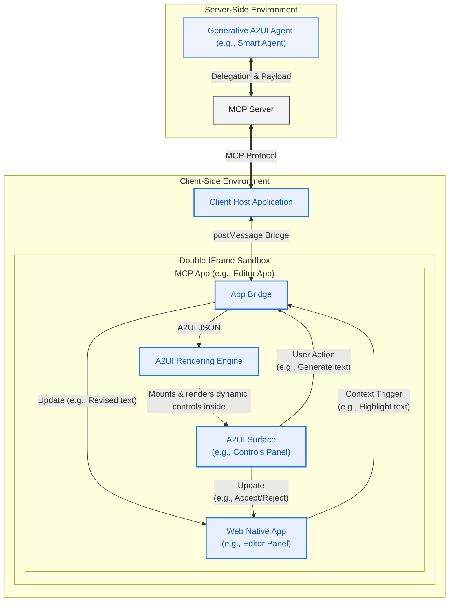
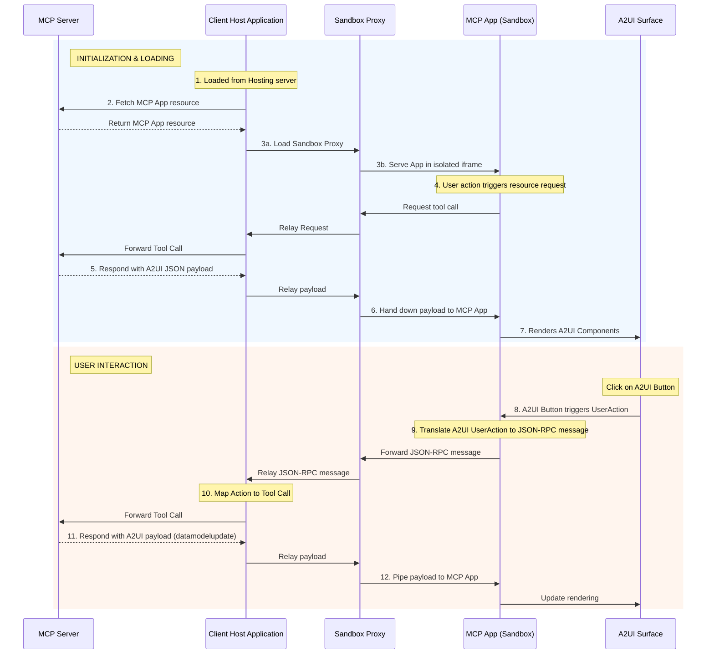

# A2UI Dynamic Rendering within MCP Applications

This guide shows you how to serve rich, interactive A2UI interfaces within [MCP Apps](https://modelcontextprotocol.io/extensions/apps/overview) using Tools and Embedded Resources. By the end, you'll have a working MCP server that returns an MCP App which can render A2UI components and handle A2UI interactions. By supporting native A2UI within MCP Apps, your MCP server can securely collaborate with remote agents while maintaining consistency over UI styling.


## Prerequisites

- **[Python 3.10+](https://www.python.org/)**
- **[uv](https://docs.astral.sh/uv/)** — fast Python package manager
- **[Node.js 18+](https://nodejs.org/)** (for the MCP Inspector)

## Quick Start: Run the Sample

For detailed instructions on how to run this sample, please refer to the [README.md](https://github.com/a2ui-project/a2ui/blob/main/samples/community/mcp/a2ui-in-mcpapps/README.md).

## Architecture Overview

The system consists of three main actors interacting through a chain of communication:

1.  **Client Host Application**: The outer container (e.g., an Angular app) that connects to the MCP Server and hosts the secure sandbox for the MCP App.
2.  **MCP Application (Sandboxed)**: The untrusted third-party web application (e.g., a Lit or Angular micro-app) running inside a double-iframe sandbox. This app contains the A2UI surface.
3.  **MCP Server**: The backend server providing the application resources and handling tool calls.



## Deep Dive: The Communication Flow

A key aspect of this pattern is that the **MCP App** renders the A2UI payloads directly, rather than relying on the Client Host Application to do so.

### Loading A2UI Components in MCP Apps

Here is the sequence of events for dynamically loading A2UI components into MCP Apps:

1.  **Trigger**: The MCP App decides it needs to fetch or update UI content (e.g., on initialization or via a user-initiated Action).
2.  **Request**: The MCP App sends a JSON-RPC request to the Host via `window.parent.postMessage`.
    - _Example Method_: `ui/fetch_counter_a2ui`
3.  **Relay**: The Sandbox Proxy relays this message to the Client Host.
4.  **MCP Call**: The Client Host translates this custom message into a standard MCP `tools/call` request to the MCP Server.
    - _Example Tool_: `fetch_counter_a2ui`
5.  **Response**: The MCP Server executes the tool and returns a result containing an `application/a2ui+json` resource.
6.  **Response forwarding**: The Host receives the tool result and forwards it back down through the Sandbox Proxy to the MCP App.
7.  **Rendering**: The MCP App extracts the A2UI JSON payload from the resource and feeds it into its local A2UI `MessageProcessor`, which updates the A2UI surface dynamically.

### Handling User Actions

Interactivity within the rendered A2UI surface is handled by reversing the flow:

1.  A user clicks a button within the A2UI surface inside the MCP App.
2.  The A2UI component triggers a `userAction`.
3.  The MCP App captures this event via the A2UI `MessageProcessor.events` subscription.
4.  The MCP App packages the action and sends it as a JSON-RPC message to the Host (e.g., `ui/increase_counter`).
5.  The Host calls the corresponding tool on the MCP Server.
6.  The Server returns a new A2UI payload (representing the updated state), which is piped back to the MCP App to update the rendering.

### Sequence Diagram



## How to Implement

To build your own MCP App with A2UI capabilities, follow these steps:

### Step 1: Inlining the Renderer

MCP Apps are typically delivered as a single HTML resource from the MCP Server. To achieve this with a modern framework like Angular or React:

1.  Build your application normally to produce static assets (`index.html`, `.js`, `.css`).
2.  Use a post-build script (like the [`inline.js`](https://github.com/a2ui-project/a2ui/blob/main/samples/community/mcp/a2ui-in-mcpapps/server/apps/src/inline.js) script in the sample) to read the `index.html` and replace external `<script src="...">` and `<link rel="stylesheet" href="...">` tags with inline `<script>` and `<style>` tags containing the actual file contents.
3.  This produces a self-contained HTML file that can be safely loaded via `srcdoc` in the restricted iframe.

> [!TIP]
> **Using Vite to inline**
>
> If your project uses Vite (common for React, Vue, or Lit), you can achieve the same single-file output automatically using plugins like `vite-plugin-singlefile`. This eliminates the need for a custom post-build script by handling the inlining during the build process itself.
>
> **How to use it:**
>
> 1. **Install the plugin**:
>     ```bash
>     npm install -D vite-plugin-singlefile
>     ```
> 2. **Configure Vite**: Add the plugin to your `vite.config.ts` (or `.js`):
>
>     ```typescript
>     import {defineConfig} from 'vite';
>     import {viteSingleFile} from 'vite-plugin-singlefile';
>
>     export default defineConfig({
>       plugins: [viteSingleFile()],
>     });
>     ```
>
>     This will ensure that all JS and CSS assets are inlined into the `index.html` file on build, making it ready to be served by your MCP server as a single resource.

### Step 2: Leveraging A2UI-over-MCP

Your inlined app is now running in the sandbox. To leverage A2UI:

1.  **Include the A2UI Angular/Lit libraries** in your app's bundle.
2.  **Define a communication contract** with your Host to interact with the MCP Server.
3.  When you receive the response from the Host, look for the `application/a2ui+json` mimeType in the content.
4.  Parse the JSON text and pass it to the A2UI [`MessageProcessor`](https://github.com/a2ui-project/a2ui/blob/main/renderers/angular/src/v0_8/data/processor.ts).

**Example: Fetching and Rendering A2UI**

```typescript
// 1. Request A2UI data from Host
const result = await callHostMethod('ui/fetch_counter_a2ui');

// 2. Find and parse the A2UI resource
const a2uiResource = result.find(
  c => c.type === 'resource' && (c.resource?.mimeType === 'application/a2ui+json' || c.resource?.mimeType === 'application/json+a2ui'),
);

if (a2uiResource?.resource?.text) {
  const messages = JSON.parse(a2uiResource.resource.text);
  this.processor.processMessages(messages);
}

// Utility for JSON-RPC communication
function callHostMethod(method: string, params: any = {}): Promise<any> {
  return new Promise((resolve, reject) => {
    const requestId = `${method}-${Date.now()}`;

    const handler = (event: MessageEvent) => {
      if (event.data.id !== requestId) return;
      window.removeEventListener('message', handler);

      if (event.data.error) {
        reject(event.data.error);
      } else {
        resolve(event.data.result);
      }
    };

    window.addEventListener('message', handler);

    window.parent.postMessage(
      {
        jsonrpc: '2.0',
        id: requestId,
        method,
        params,
      },
      '*',
    ); // Note: Replace "*" with explicit target origin in production
  });
}
```

### Step 3: Handling User Actions on A2UI Components

To handle interactivity within the rendered A2UI surface, your MCP App must capture A2UI events and forward them to the Host using JSON-RPC.

**Example: Handling User Actions**

```typescript
// Subscribing to A2UI events in the MCP App ([main.ts](https://github.com/a2ui-project/a2ui/blob/main/samples/community/mcp/a2ui-in-mcpapps/server/apps/src/src/main.ts))
this.processor.events.subscribe(async event => {
  if (!event.message.userAction) return;

  const method = `ui/${event.message.userAction.name}`;
  const params = event.message.userAction.context;

  try {
    // Translate A2UI UserAction to JSON-RPC, send to Host, and await response
    const result = await callHostMethod(method, params);

    // Parse the updated A2UI payload and update the rendering
    const messages = extractA2UIMessages(result);
    if (messages) {
      this.processor.processMessages(messages);
    }
  } catch (error) {
    console.error(`Error handling user action[${method}]:`, error);
  }
});
```

This pattern enables the MCP App to serve as a dynamic interface for the MCP Server's A2UI capabilities while maintaining strict security isolation.

### Inlined MCP App HTML Pseudocode

To put this all together, here is an HTML mockup representing a compiled and inlined MCP Application. It defines the placeholder UI with a native `<a2ui-surface>` element, initializes the `AppBridge` to communicate with the outer host, fetches its dynamic A2UI layout on load, and processes events using the loaded A2UI SDK:

```html
<!DOCTYPE html>
<html lang="en">
  <head>
    <meta charset="UTF-8" />
    <title>Inlined MCP App Surface</title>
    <!-- Assumes the standard A2UI SDK script is bundled or loaded -->
  </head>
  <body>
    <div>
      <h3>MCP App (Editor Panel)</h3>
      <p>This text is native to the sandboxed third-party app.</p>

      <!-- A2UI Surface custom element provided by the A2UI SDK -->
      <a2ui-surface surfaceId="recipe-card"></a2ui-surface>
    </div>

    <script>
      // Note: The pseudocode below assumes AppBridge from @modelcontextprotocol/ext-apps
      // and a2uiProcessor from the A2UI SDK are preloaded or inlined.
      const bridge = new AppBridge({name: 'editor-panel', version: '1.0.0'});

      // Helper to extract and process dynamic A2UI responses from tool results
      function processA2UIResponse(result) {
        const a2uiResource = result?.content?.find(
          c => c.type === 'resource' && (c.resource?.mimeType === 'application/a2ui+json' || c.resource?.mimeType === 'application/json+a2ui'),
        );
        if (a2uiResource?.resource?.text) {
          const payload = JSON.parse(a2uiResource.resource.text);
          window.a2uiProcessor.processMessages(payload);
        }
      }

      // 1. Initialize AppBridge and fetch initial controls
      async function initApp() {
        await bridge.connect();

        // Call server tool to load initial layout controls
        const result = await bridge.callServerTool({name: 'fetch_controls', arguments: {}});
        processA2UIResponse(result);
      }

      // 2. Handle interactive User Actions routed by the A2UI SDK
      window.a2uiProcessor.events.subscribe(async event => {
        if (!event.message.userAction) return;
        const action = event.message.userAction;

        // Route the user action directly via the bridge to the MCP Server tool
        const result = await bridge.callServerTool({
          name: action.name,
          arguments: action.context,
        });

        // Feed any updated server UI states back to the A2UI processor
        processA2UIResponse(result);
      });

      // Initialize the app on startup
      initApp();
    </script>
  </body>
</html>
```

## Security Considerations

- **Explicit Target Origin**: Always use specific target origins (e.g., `'https://trusted-host.com'`) instead of `*` when calling `postMessage` if the host origin is known. This prevents malicious iframes from intercepting your RPC requests.
- **Null Origin Handling**: Remember that inside a strict sandbox (`sandbox="allow-scripts"` without `allow-same-origin`), `window.location.origin` will evaluate to `"null"`. You must validate incoming messages carefully by comparing `event.source` against the expected window object (e.g., `window.parent`).
