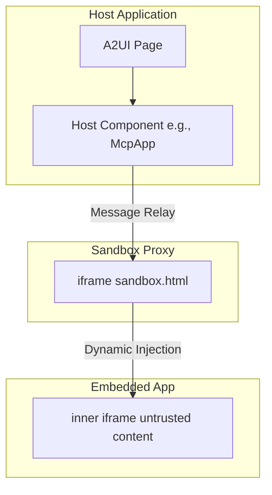
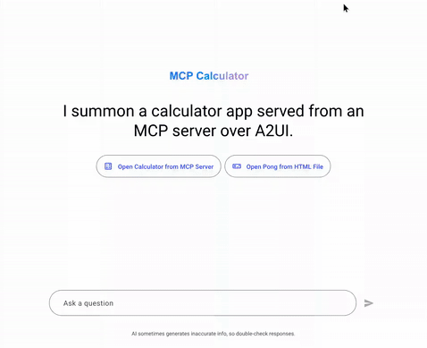

# MCP Apps Integration in A2UI Surfaces

This guide explains how **Model Context Protocol (MCP) Applications** are integrated and displayed within the **A2UI** surface, along with the security model and testing guidelines.

> NOTE: Looking for the core A2UI-over-MCP protocol? See [A2UI over MCP](a2ui_over_mcp.md) for how to return A2UI JSON payloads from MCP tool calls.

## Overview

The Model Context Protocol (MCP) allows MCP servers to deliver rich, interactive HTML-based user interfaces to hosts. A2UI provides a secure environment to run these third-party applications.

## Double-Iframe Isolation Pattern

To run untrusted third-party code securely, A2UI utilizes a **double-iframe** isolation pattern. This approach isolates raw DOM injection from the main application while maintaining a structured JSON-RPC channel.

### Security Rationale

Standard single-iframe sandboxing with `allow-scripts` is often bypassed if combined with `allow-same-origin`, which defeats the containerization. Any iframe with `allow-scripts` and `allow-same-origin` can escape its sandbox by programmatically interacting with its parent DOM or removing its own sandbox attribute.

To prevent this, A2UI strictly excludes `allow-same-origin` for the inner iframe where the third-party application runs.

### The Architecture

1.  **[Sandbox Proxy (`sandbox.html`)](https://github.com/google/A2UI/blob/main/samples/client/shared/mcp_apps_inner_iframe/sandbox.html)**: An intermediate `iframe` served from the same origin. It isolates raw DOM injection from the main app while maintaining a structured JSON-RPC channel.
    -   Permissions: **Do not sandbox** in the host template (e.g., [`mcp-app.ts`](https://github.com/google/A2UI/blob/main/samples/client/angular/projects/mcp_calculator/src/a2ui-catalog/mcp-app.ts) or [`mcp-apps-component.ts`](https://github.com/google/A2UI/blob/main/samples/client/lit/contact/ui/custom-components/mcp-apps-component.ts)).
    -   Host origin validation: Validates that messages come from the expected host origin.
2.  **Embedded App (Inner Iframe)**: The innermost `iframe`. Injected dynamically via `srcdoc` with restricted permissions.
    -   Permissions: `sandbox="allow-scripts allow-forms allow-popups allow-modals"` (**MUST NOT** include `allow-same-origin`).
    -   Isolation: Removes access to `localStorage`, `sessionStorage`, `IndexedDB`, and cookies due to unique origin.

### Architecture Diagram



## Usage / Code Example

The MCP Apps component typically resolves to a `custom` node in the A2UI catalog. Here is how a developer might use it in their code.

### 1. Register within the Catalog

You must register the component in your catalog application. For example, in Angular:

```typescript
import { Catalog } from '@a2ui/angular';
import { inputBinding } from '@angular/core';

export const DEMO_CATALOG = {
  McpApp: {
    type: () => import('./mcp-app').then((r) => r.McpApp),
    bindings: ({ properties }) => [
      inputBinding(
        'content',
        () => ('content' in properties && properties['content']) || undefined,
      ),
      inputBinding('title', () => ('title' in properties && properties['title']) || undefined),
    ],
  },
} as Catalog;
```

### 2. Usage in A2UI Message

In the Host or Agent context, send an A2UI message that translates to this custom node.

```json
{
  "type": "custom",
  "name": "McpApp",
  "properties": {
    "content": "<h1>Hello, World!</h1>",
    "title": "My MCP App"
  }
}
```

If the content is complex or requires encoding, you can pass a URL-encoded string:

```json
{
  "type": "custom",
  "name": "McpApp",
  "properties": {
    "content": "url_encoded:%3Ch1%3EHello%2C%20World!%3C%2Fh1%3E",
    "title": "My MCP App"
  }
}
```

## Communication Protocol

Communication between the Host and the embedded inner iframe is facilitated via a structured JSON-RPC channel over `postMessage`.

-   **Events**: The Host Component listens for a `SANDBOX_PROXY_READY_METHOD` message from the proxy.
-   **Bridging**: An `AppBridge` handles message relaying. Developers (specifically the MCP App Developer inside the untrusted iframe) can call tools on the MCP server using `bridge.callTool()`.
-   **The Host**: Resolves callbacks (e.g., specific resizing, Tool results).

### Limitations

Because `allow-same-origin` is strictly omitted for the innermost iframe, the following conditions apply:
-   The MCP app **cannot** use `localStorage`, `sessionStorage`, `IndexedDB`, or cookies. Each application runs with a unique origin.
-   Direct DOM manipulation by the parent is blocked. All interactions must proceed via message passing.

## Prerequisites

To run the samples, ensure you have the following installed:
-   **Python (uv)** (version 3.12 or higher suggested)
-   **Node.js (npm)** (version 18 or higher recommended)

## Samples

There are two primary samples demonstrating MCP Apps integration:

### 1. Contact Multi-Surface Sample (Lit & ADK Agent)

This sample verifies the sandbox with a Lit-based client and an ADK-based A2A agent.

-   **A2A Agent Server**:
    -   Path: [`samples/agent/adk/contact_multiple_surfaces/`](https://github.com/google/A2UI/tree/main/samples/agent/adk/contact_multiple_surfaces/)
    -   Command: `uv run .` (requires `GEMINI_API_KEY` in `.env`)
-   **Lit Client App**:
    -   Path: [`samples/client/lit/contact/`](https://github.com/google/A2UI/tree/main/samples/client/lit/contact/)
    -   Command: `npm run dev` (requires building the Lit renderer first)
    -   URL: `http://localhost:5173/`

**What to expect**: A contact page where actions prompt an app interface on specific interactions.

### 2. MCP Apps (Calculator + Pong) (Angular)

This sample verifies the sandbox with an Angular-based client, an MCP Proxy Agent, and a remote MCP Server.

-   **MCP Server (Calculator)**:
    -   Path: [`samples/agent/mcp/mcp-apps-calculator/`](https://github.com/google/A2UI/tree/main/samples/agent/mcp/mcp-apps-calculator/)
    -   Command: `uv run .` (runs on port 8000)
-   **MCP Apps Proxy Agent**:
    -   Path: [`samples/agent/adk/mcp_app_proxy/`](https://github.com/google/A2UI/tree/main/samples/agent/adk/mcp_app_proxy/)
    -   Command: `uv run .` (requires `GEMINI_API_KEY` in `.env`)
-   **Angular Client App**:
    -   Path: [`samples/client/angular/`](https://github.com/google/A2UI/tree/main/samples/client/angular/)
    -   Command: `npm start -- mcp_calculator` (requires `npm run build:sandbox` and `npm install`)
    -   URL: `http://localhost:4200/?disable_security_self_test=true`

**What to expect**: A set of smart chips to load calculator app or pong app will be rendered. Both apps run in their own sandboxed iframes.

| Calculator App | Pong App |
| :---: | :---: |
|  |  |

## URL Options for Testing

For testing purposes, you can opt-out of the security self-test by using specific URL query parameters.

`disable_security_self_test=true`

This query parameter allows you to bypass the security self-test that verifies iframe isolation. This is useful for debugging and testing environments.

Example usage:
`http://localhost:4200/?disable_security_self_test=true`
