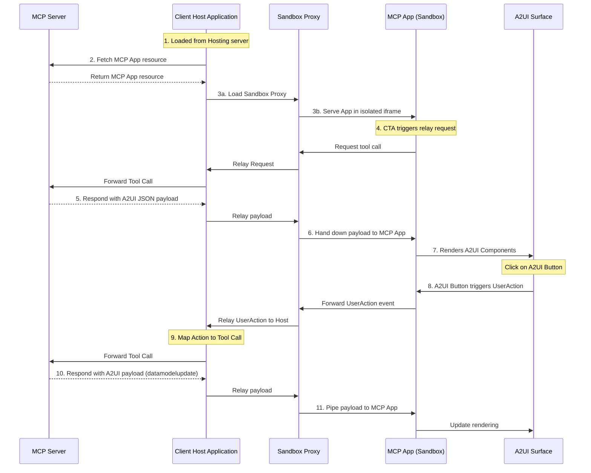

# A2UI in MCP Apps Sample

This sample demonstrates a Model Context Protocol (MCP) Application Host that isolation-tests untrusted third-party Angular components via a secure double-iframe proxy pattern.

## Architecture

- **`client/`**: The host container application (Angular). It hosts the outer safe iframe.
- **`server/`**: The MCP Server (Python/uv) that provides the micro-app resources and tools.
- **`server/apps/src/`**: The source source code for the server-hosted isolated micro-app.

## Communication Flow



---

## Prerequisites

- [Node.js](https://nodejs.org/) (runs the client and build scripts)
- [Python 3.10+](https://www.python.org/) with `uv` (runs the MCP server)

---

## Build & Regeneration

This sample relies on some generated bundle artifacts. Some are committed for convenience, while others are ignored and must be built.

### 1. Build Client Sandbox Bridge

The sandboxed iframe needs its asset bundle. Run this in the `client/` directory:

```bash
cd client
npm install
npm run build:sandbox
```

_(Generates `client/public/sandbox_iframe/sandbox.{js,html}`)_

### 2. Rebuild the Server Hosted App (Optional)

The server serves a bundled `app.html` artifact located in `server/apps/public/app.html`. If you modify the source code in `server/apps/src/`, you must regenerate this list:

Run this in the `server/apps/src/` directory:

```bash
cd server/apps/src
npm install
npm run build:all
```

_(Runs Angular compilation and triggers `node inline.js` to single-file inline it into `server/apps/public/app.html`)_

---

## Running the Sample

### 1. Start the MCP Server

Run this in the `server/` directory:

```bash
cd server
uv sync
uv run python server.py --transport sse --port 8000
```

### 2. Start the Host Client

Run this in the `client/` directory:

```bash
cd client
npm run start
```

Navigate to `http://localhost:4200` to view the running host.
